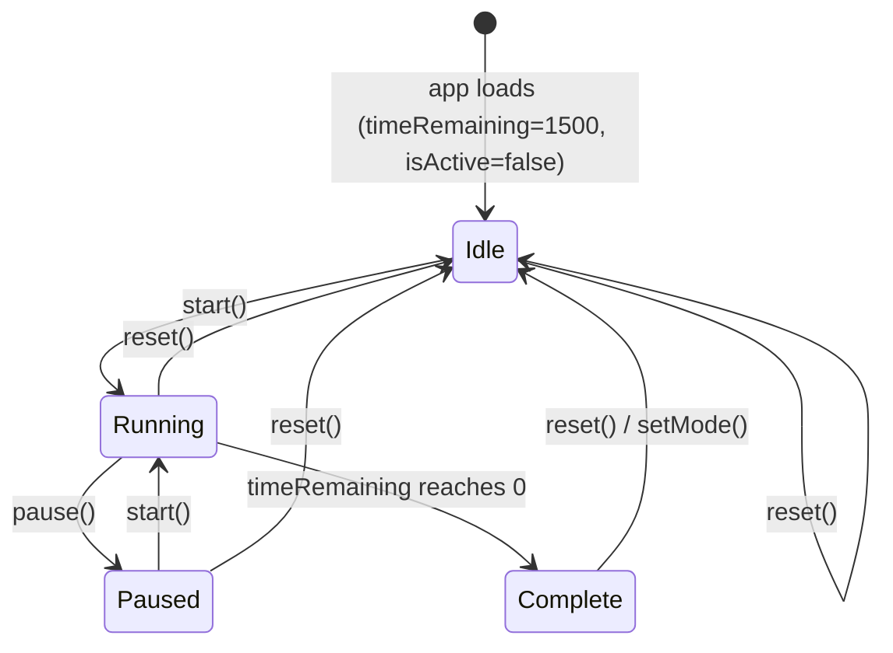

# Design Document

## Overview

The Pomodoro Timer is a React Native (Expo) mobile application feature that implements the Pomodoro Technique: a focused 25-minute work session that counts down to zero, plays an audible alert on completion, and resets automatically for the next session. The user can start, pause, resume, and reset the timer at any point.

The feature is built on React state and hooks for all timer logic, `expo-av` for audio playback, and React Native's core components for the UI. The existing codebase already has a partial implementation — `components/Timer.tsx` (display), `components/Header.tsx` (session-type switcher), and `app/(tabs)/index.tsx` (orchestration screen) — which this design will refine and complete.

**Key design goals:**
- All countdown logic is encapsulated in a dedicated custom hook (`useTimer`) so the UI components stay pure and testable.
- The `Timer` component is a pure display component that receives time as seconds and formats it independently.
- Notification (sound + visual fallback) is handled by a dedicated `NotificationService` abstraction.
- State transitions are explicit and guard against invalid operations (e.g., starting when time is 0).

---

## Architecture

The feature follows a layered architecture:

```
┌─────────────────────────────────────────────────────┐
│                  UI Layer                           │
│  HomeScreen  →  Header  +  Timer  +  ControlBar    │
└───────────────────┬─────────────────────────────────┘
                    │ props / callbacks
┌───────────────────▼─────────────────────────────────┐
│              State / Logic Layer                    │
│              useTimer (custom hook)                 │
└───────────────────┬─────────────────────────────────┘
                    │
┌───────────────────▼─────────────────────────────────┐
│              Service Layer                          │
│         NotificationService (expo-av)               │
└─────────────────────────────────────────────────────┘
```

### Component Hierarchy

```
HomeScreen (app/(tabs)/index.tsx)
├── Header           – session-type switcher (Pomodoro / Short Break / Long Break)
├── Timer            – pure display of remaining time in MM:SS
└── ControlBar       – Start/Pause and Reset buttons
```

### Data Flow

1. `HomeScreen` owns no timer logic directly — it delegates to `useTimer`.
2. `useTimer` exposes `{ timeRemaining, isActive, isComplete, start, pause, reset, setMode }`.
3. On every relevant state change, `useTimer` triggers `NotificationService.playAlert()` when the session completes.
4. `Timer` receives `timeRemaining: number` (seconds) and formats it — it holds no state.
5. `Header` calls `setMode(mode)` on selection, which resets the duration inside `useTimer`.

---

## Components and Interfaces

### `useTimer` (custom hook)

Located at `hooks/use-timer.ts`.

```typescript
type TimerMode = 'pomodoro' | 'shortBreak' | 'longBreak';

type TimerState = {
  timeRemaining: number;   // seconds remaining
  isActive: boolean;       // true while countdown is running
  isComplete: boolean;     // true when timeRemaining reached 0
  mode: TimerMode;
};

type TimerActions = {
  start: () => void;
  pause: () => void;
  reset: () => void;
  setMode: (mode: TimerMode) => void;
};

export function useTimer(): TimerState & TimerActions;
```

**Behaviour contracts:**
- `start()` is a no-op when `timeRemaining === 0` or `isActive === true`.
- `pause()` is a no-op when `isActive === false`.
- `reset()` sets `timeRemaining` to the full duration for the current mode, sets `isActive = false`, and sets `isComplete = false`.
- `setMode(mode)` implicitly calls `reset()` with the new mode's duration.
- When `timeRemaining` reaches `0`, the hook sets `isActive = false`, `isComplete = true`, and calls `NotificationService.notify()`.

**Mode durations:**

| Mode         | Duration (seconds) |
|--------------|--------------------|
| `pomodoro`   | 1500               |
| `shortBreak` | 300                |
| `longBreak`  | 900                |

### `Timer` component

Located at `components/Timer.tsx` (existing — will be updated).

```typescript
type TimerProps = {
  timeRemaining: number;  // seconds
  isComplete: boolean;
};
```

Formats `timeRemaining` into `MM:SS` with zero-padding. Shows `00:00` and a "Session complete" label when `isComplete === true`.

### `Header` component

Located at `components/Header.tsx` (existing — minor update).

```typescript
type HeaderProps = {
  mode: TimerMode;
  onModeChange: (mode: TimerMode) => void;
};
```

Replaces raw index-based props with a typed `TimerMode` to decouple it from `HomeScreen`'s internal array indexing.

### `ControlBar` component

New component at `components/ControlBar.tsx`.

```typescript
type ControlBarProps = {
  isActive: boolean;
  isComplete: boolean;
  onStartPause: () => void;
  onReset: () => void;
};
```

Renders a single **Start / Pause** toggle button (disabled when `isComplete`) and a **Reset** button. The start/pause label switches based on `isActive`.

### `NotificationService`

Located at `services/notification-service.ts`.

```typescript
interface INotificationService {
  notify(): Promise<void>;
}
```

`notify()` attempts `expo-av` audio playback of `assets/audio/click.mp3`. If playback fails (audio unavailable, device muted at OS level), it falls back to an in-app `Alert.alert()` with a "Session complete" message.

```typescript
export const NotificationService: INotificationService = {
  async notify() {
    try {
      const { sound } = await Audio.Sound.createAsync(
        require('../assets/audio/click.mp3')
      );
      await sound.playAsync();
      // Unload after playback to free memory
      sound.setOnPlaybackStatusUpdate((status) => {
        if (status.isLoaded && status.didJustFinish) {
          sound.unloadAsync();
        }
      });
    } catch {
      Alert.alert('Session Complete', 'Your 25-minute session has ended.');
    }
  },
};
```

---

## Data Models

### Timer state (managed by `useTimer`)

| Field           | Type        | Initial value | Description                              |
|-----------------|-------------|---------------|------------------------------------------|
| `timeRemaining` | `number`    | `1500`        | Seconds left in the current session      |
| `isActive`      | `boolean`   | `false`       | Whether the countdown interval is running|
| `isComplete`    | `boolean`   | `false`       | Whether the last session reached zero    |
| `mode`          | `TimerMode` | `'pomodoro'`  | Current session type                     |

### Mode duration map

```typescript
const MODE_DURATIONS: Record<TimerMode, number> = {
  pomodoro:   1500,   // 25 min
  shortBreak: 300,    // 5 min
  longBreak:  900,    // 15 min
};
```

### State transition diagram



### `useTimer` interval lifecycle (React `useEffect`)

```
useEffect(() => {
  if (!isActive) return;

  const id = setInterval(() => {
    setTimeRemaining(prev => {
      if (prev <= 1) {
        setIsActive(false);
        setIsComplete(true);
        NotificationService.notify();
        return 0;
      }
      return prev - 1;
    });
  }, 1000);

  return () => clearInterval(id);   // cleanup on pause, unmount, or mode change
}, [isActive]);
```

The cleanup function guarantees the interval is cleared whenever `isActive` becomes `false` or the component unmounts, satisfying Requirement 7.5.

---

## Correctness Properties

*A property is a characteristic or behavior that should hold true across all valid executions of a system — essentially, a formal statement about what the system should do. Properties serve as the bridge between human-readable specifications and machine-verifiable correctness guarantees.*

### Property 1: Time formatting round-trip

*For any* integer number of seconds in the range [0, 5999], the `formatTime` function SHALL produce a string of the form `MM:SS` where both parts are zero-padded to two digits, and parsing that string back SHALL recover the original second count.

**Validates: Requirements 5.3, 5.4**

### Property 2: Countdown decrements by exactly 1 per tick

*For any* active timer state with `timeRemaining > 0`, after a single interval tick the resulting `timeRemaining` SHALL equal the previous value minus exactly 1.

**Validates: Requirements 2.1, 5.1**

### Property 3: Start is a no-op when time is zero

*For any* timer state where `timeRemaining === 0`, calling `start()` SHALL leave `isActive === false` and `timeRemaining === 0` unchanged.

**Validates: Requirements 2.5, 3.3**

### Property 4: Reset always restores the full session duration

*For any* timer state (running, paused, or complete) and any current mode, calling `reset()` SHALL set `timeRemaining` to `MODE_DURATIONS[mode]` and `isActive` to `false`.

**Validates: Requirements 4.1, 4.2, 4.3**

### Property 5: Pause preserves remaining time

*For any* running timer state with `timeRemaining = T`, calling `pause()` SHALL set `isActive = false` and leave `timeRemaining` equal to `T` (no decrement occurs after pause).

**Validates: Requirements 2.2, 3.1**

### Property 6: Mode change resets to correct duration

*For any* timer mode `m`, calling `setMode(m)` SHALL result in `timeRemaining === MODE_DURATIONS[m]` and `isActive === false`, regardless of prior timer state.

**Validates: Requirements 1.1, 4.1**

### Property 7: Session completion triggers notification exactly once

*For any* sequence of start → countdown-to-zero, the `NotificationService.notify()` function SHALL be called exactly once when `timeRemaining` transitions from `1` to `0`.

**Validates: Requirements 6.1, 6.2**

---

## Error Handling

| Scenario | Behaviour |
|---|---|
| Audio asset missing or unloadable | `NotificationService.notify()` catches the error and falls back to `Alert.alert()` |
| Audio playback muted / unavailable | Same fallback path; `expo-av` throws on `playAsync()` failure |
| App loads with `timeRemaining !== 1500` | `useTimer` initializes from `MODE_DURATIONS['pomodoro']` by construction; impossible in practice, but the initializer is the single source of truth |
| `start()` called with `timeRemaining === 0` | Guard clause returns early; `isActive` stays `false` |
| Component unmounts while timer is running | `useEffect` cleanup clears the interval, preventing state updates on unmounted components |
| `setMode()` called while timer is running | Implicitly pauses (clears interval) and resets before applying new duration |

---

## Testing Strategy

### Unit tests (Jest + React Native Testing Library)

Unit tests cover specific examples, edge cases, and integration points.

**`hooks/use-timer.test.ts`**
- Timer initializes to 1500 seconds, inactive, not complete
- `start()` sets `isActive = true`
- `pause()` sets `isActive = false` while preserving `timeRemaining`
- `reset()` restores full duration and sets `isActive = false`
- `start()` is a no-op when `timeRemaining === 0`
- `setMode('shortBreak')` sets `timeRemaining = 300`
- Session completion triggers `NotificationService.notify` mock

**`components/Timer.test.tsx`**
- Renders `25:00` for 1500 seconds
- Renders `00:00` for 0 seconds
- Renders `09:05` for 545 seconds (leading-zero padding on both fields)
- Renders `00:30` for 30 seconds
- Shows "Session complete" label when `isComplete === true`

**`services/notification-service.test.ts`**
- `notify()` calls `Audio.Sound.createAsync` and `playAsync`
- When `playAsync` throws, falls back to `Alert.alert`

### Property-based tests (fast-check)

Property-based tests use [fast-check](https://fast-check.io/) (JavaScript/TypeScript PBT library) with a minimum of **100 iterations per property**.

Each test is tagged with its design property using the comment format:
`// Feature: pomodoro-timer, Property N: <property_text>`

**`hooks/use-timer.properties.test.ts`**

- **Property 1** — Time formatting round-trip  
  `fc.integer({ min: 0, max: 5999 })` → format → parse → assert equal to original  
  `// Feature: pomodoro-timer, Property 1: time formatting round-trip`

- **Property 2** — Countdown decrements by exactly 1 per tick  
  `fc.integer({ min: 1, max: 5999 })` as starting `timeRemaining` → simulate one tick → assert `result === input - 1`  
  `// Feature: pomodoro-timer, Property 2: countdown decrements by exactly 1 per tick`

- **Property 3** — Start is a no-op when time is zero  
  Always `timeRemaining = 0` → call `start()` → assert `isActive === false && timeRemaining === 0`  
  `// Feature: pomodoro-timer, Property 3: start is a no-op when time is zero`

- **Property 4** — Reset always restores full session duration  
  `fc.record({ timeRemaining: fc.integer({ min: 0, max: 5999 }), isActive: fc.boolean(), mode: fc.constantFrom('pomodoro', 'shortBreak', 'longBreak') })` → call `reset()` → assert `timeRemaining === MODE_DURATIONS[mode] && !isActive`  
  `// Feature: pomodoro-timer, Property 4: reset always restores full session duration`

- **Property 5** — Pause preserves remaining time  
  `fc.integer({ min: 1, max: 5999 })` as `timeRemaining` with `isActive = true` → call `pause()` → assert `!isActive && timeRemaining === original`  
  `// Feature: pomodoro-timer, Property 5: pause preserves remaining time`

- **Property 6** — Mode change resets to correct duration  
  `fc.constantFrom('pomodoro', 'shortBreak', 'longBreak')` → call `setMode(mode)` from any state → assert `timeRemaining === MODE_DURATIONS[mode] && !isActive`  
  `// Feature: pomodoro-timer, Property 6: mode change resets to correct duration`

- **Property 7** — Session completion triggers notification exactly once  
  Simulate a full countdown from any `timeRemaining > 0` to 0 → assert `notifyMock` called exactly once  
  `// Feature: pomodoro-timer, Property 7: session completion triggers notification exactly once`

### Integration tests

- End-to-end render test: `HomeScreen` renders with `25:00` visible, Start button visible, no pause button visible.
- Start → tick → pause flow: after pressing Start and advancing fake timers by 1 second, display shows `24:59`; after pressing Pause, display holds at `24:59`.
- Reset flow: after pressing Start and ticking several seconds, pressing Reset restores `25:00` and Start button.
- Session completion: advance fake timers by 1500 seconds from start → `NotificationService.notify` mock called once, display shows `25:00`.

### Test tooling

| Tool | Purpose |
|---|---|
| Jest | Test runner (via Expo's preset) |
| `@testing-library/react-native` | Component rendering and interaction |
| `fast-check` | Property-based testing (min 100 iterations) |
| `jest.useFakeTimers()` | Control `setInterval` in timer tests without real delays |
| `jest.mock('expo-av')` | Prevent real audio calls in unit/property tests |
